forked from: https://github.com/chris-stanton/APP-people-sourced-policy

# People Sourced Policy Web App

---

## Description:
#### People Sourced Policy is an app that allows the Twin Cities communities get involved within the community of Minneapolis.  Once logged in, User's can participate by adding their own ideas to the pre selected topics for each trimester or comment on other peoples ideas.  Each tri-srmester contains a main topic with five sub-topics that pertain to the main topic.  The app includes a user rights as well as admin rights where "admin" can change the topics, manage all comments and ideas and manage all users.  The admin has complete control of the app.  App is both desktop and mobile friendly.

---

##### App can be viewed here: https://psp-communitysite-phi.herokuapp.com/

---

###### User Home:
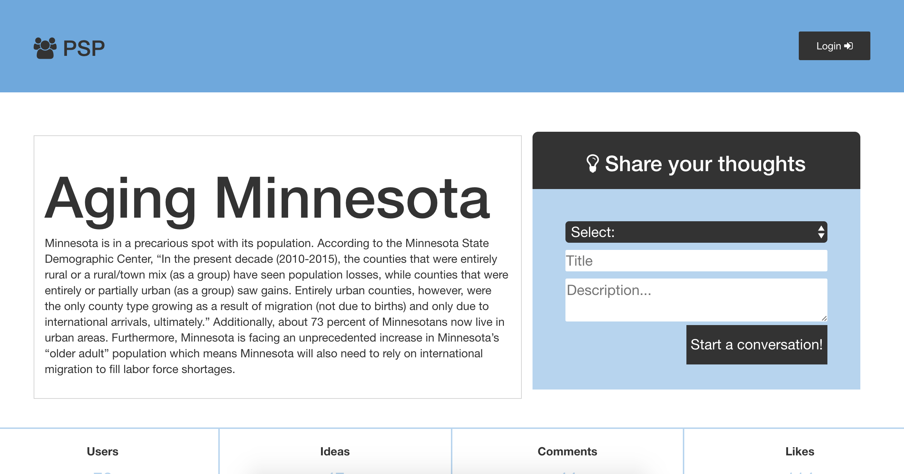

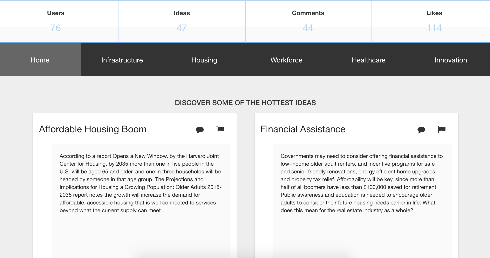

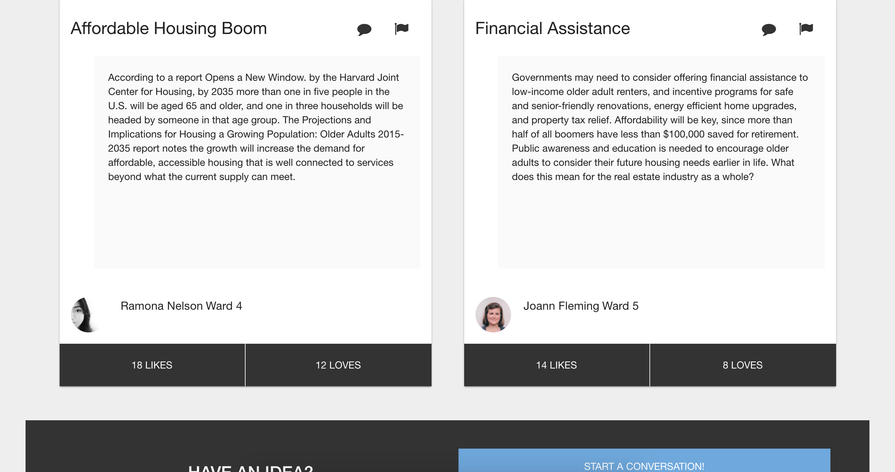

###### User Idea:
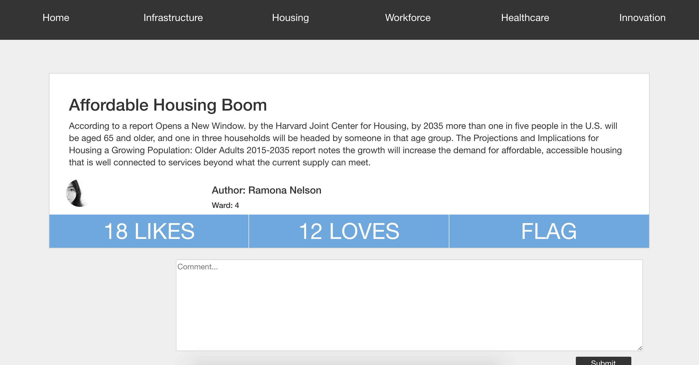

###### User Subtopic:
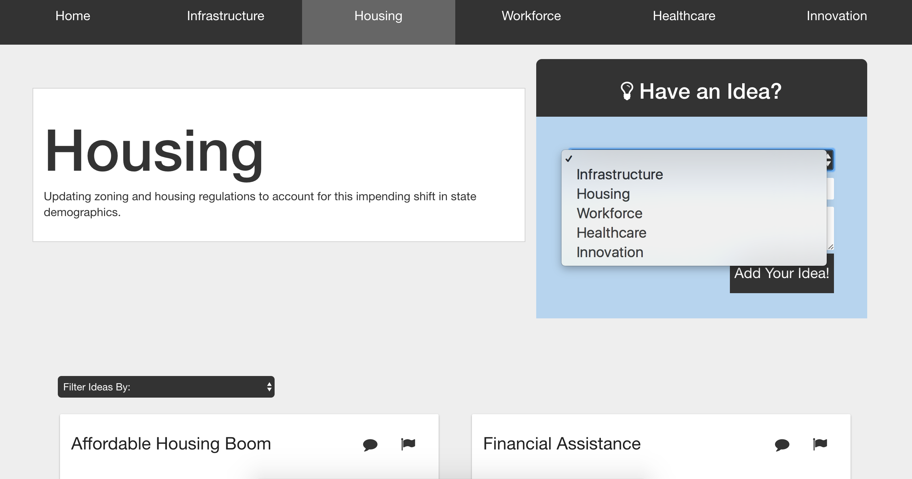

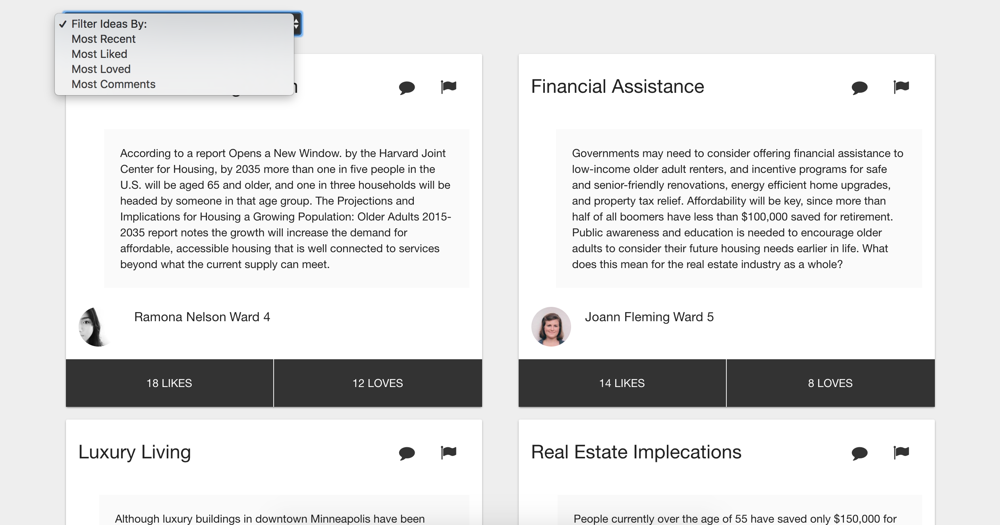

###### User Comment:
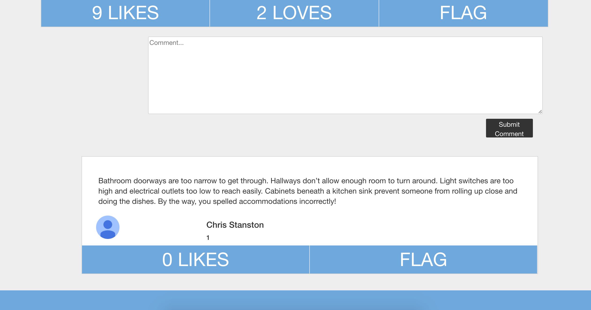

###### Admin Nav Bar:
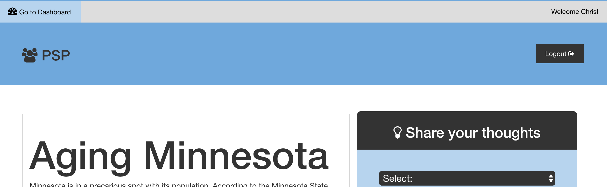

###### Admin Manage Users:
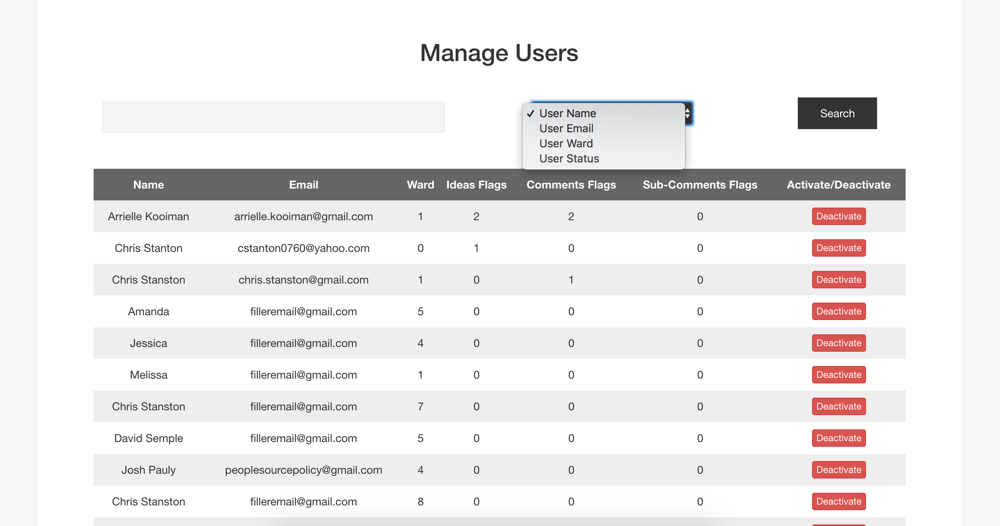

###### Admin Manage Flags:
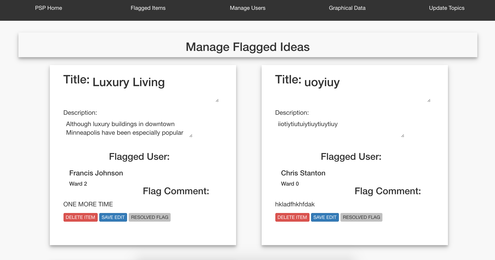

###### Admin Data Desktop:


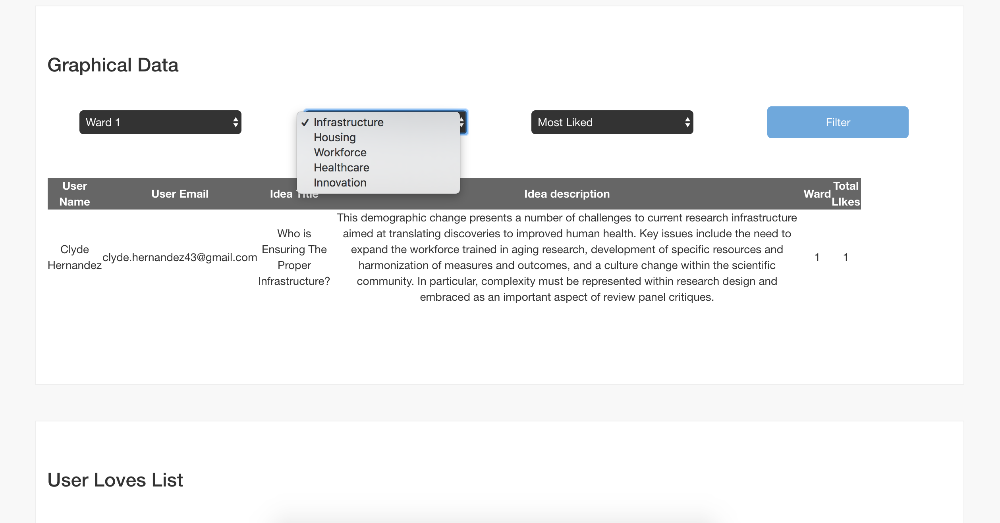

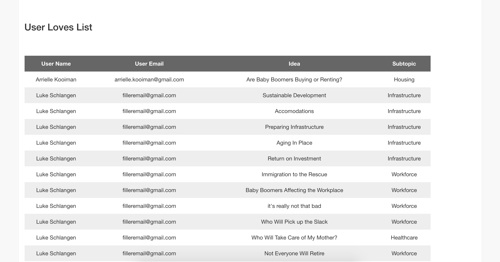

###### Admin Update topics:
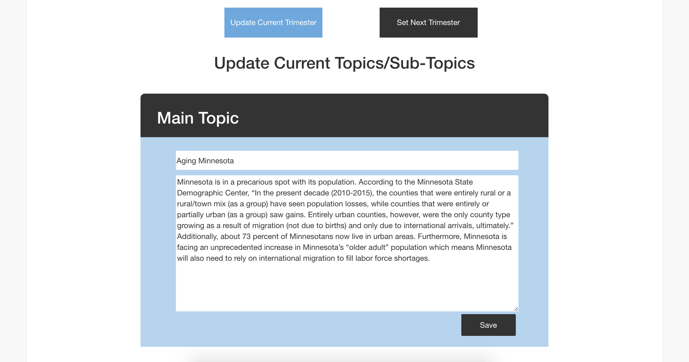

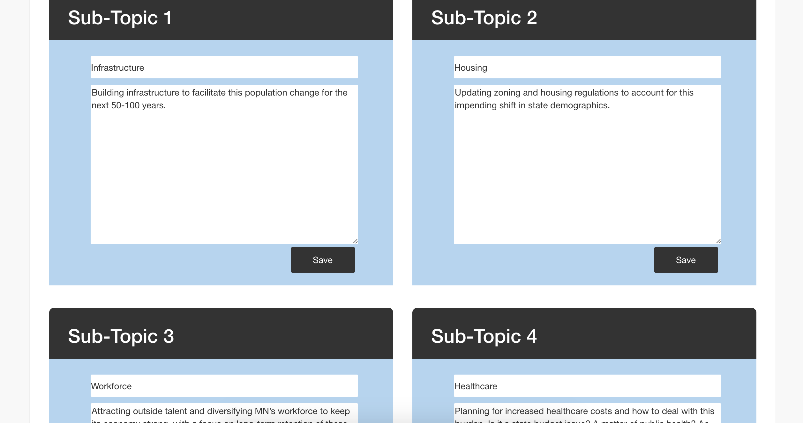

###### Admin Create Next Trimester Topics

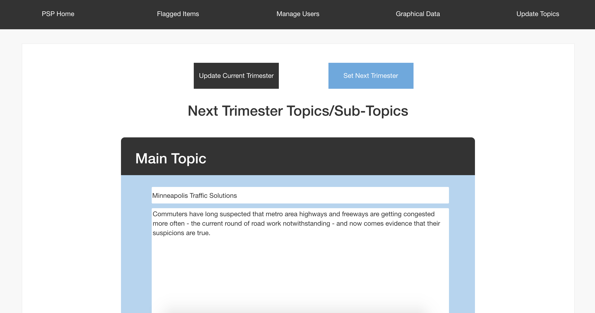

---

## Technologies Used
  - Node.js
  - Angular.js
  - Angular Route
  - angular-tooltips
  - Angular-material
  - Express.js
  - Body-Parser
  - PG  
  - Bootstrap
  - Firebase
  - Firebase-admin
  - Charts.js
  - GIT / GitHub
  - Heroku

---

## Download App
  1. Download zip file
  2. Open terminal and navigate into folder

---  

## Create Firebase Account
  1. Create a free Firebase account at https://firebase.google.com

  2. Create a project from your Firebase account console

  3. Add a connection to firebase on your front end
    1. Click the “Add Firebase to your web app” icon
    2. Copy the contents WITHOUT SCRIPT TAGS or the CDN from the resulting popup into ``public/scripts/config.js``. It should look like this:

    ```
      // Initialize Firebase
        var config = {
          apiKey: "XXXXXXXXXXXXXXXXXXXXXX",
          authDomain: "XXXXXXXXXXXX.firebaseapp.com",
          databaseURL: "https://XXXXXXXXXXXX.firebaseio.com",
          storageBucket: "XXXXXXXXXXXX.appspot.com",
          messagingSenderId: "XXXXXXXXXX"
        };
        firebase.initializeApp(config);
     ```

  4. Add firebase service account to your node.js project
    1. Navigate to the [Service Accounts](https://console.firebase.google.com/project/_/settings/serviceaccounts/adminsdk) tab in your project's settings page.
    2. Select your Firebase project.
    3. Copy your ``databaseURL`` from the ``Admin SDK configuration snippet``. The line you need will look like this: ``databaseURL: "https://XXXXXXXXX.firebaseio.com"``.
    4. Navigate to the ``server/modules/decoder.js`` file in the node project and replace the databaseURL. Only replace that line. It is inside of the ``admin.initializeApp``:

    ```
      admin.initializeApp({
        credential: admin.credential.cert("./server/firebase-service-account.js",
        // replace this line with your URL
        databaseURL: "https://XXXXXXXXX.firebaseio.com"        
      });
    ```

  5. Return to firebase [Service Accounts](https://console.firebase.google.com/project/_/settings/serviceaccounts/adminsdk). Navigate to your project again if you have left it.
  6. Click the Generate New Private Key button at the bottom of the Firebase Admin SDK section of the Service Accounts tab.
  7. Rename the new JSON file to `firebase-service-account.json` and save it in the `server` folder of your application.

  8. Return to Firebase console. Configure Google as an authentication provider for your Firebase project.
    1. In the Firebase console for your project (you may already be there from the previous step), click "Authentication" in left panel
    2. Click "Set Up Sign-In Method" button
    3. Select "Google"
    4. Click the "edit" icon
    5. Toggle Google to `on`

---

#### Google Civic API

  1. Follow directions from Google Civiv API documentation here: https://developers.google.com/civic-information/

---
#### Local postgresql Setup
1. download and install postgresql
  - [useful resource for Mac users](https://www.codementor.io/devops/tutorial/getting-started-postgresql-server-mac-osx)
2. Create database for local development
  - CREATE DATABASE psp_database;
  - OR
  - createdb -U postgres psp_database
3. Run database.sql to populate the database
  - psql -d psp_database -a -f database.sql
  - run this from within the projects root directory


---

#### Start App
  1. Run commands:
    - ``` npm install ``` Installs Node Packages including dependencies from package.json
    - ``` brew services start postgresql ``` Starts DB server connection to Postico (or equivalent for MongoDB)
    - ``` npm start ``` Starts server
    - ``` npm test ``` Starts server using Nodemon
  2. Server is listening on port: 5000


---

### License

Copyright (c) 2017 Chris Stanton

Permission is hereby granted, free of charge, to any person obtaining a copy of this software and associated documentation files (the "Software"), to deal in the Software without restriction, including without limitation the rights to use, copy, modify, merge, publish, distribute, sublicense, and/or sell copies of the Software, and to permit persons to whom the Software is furnished to do so, subject to the following conditions:

The above copyright notice and this permission notice shall be included in all copies or substantial portions of the Software.

THE SOFTWARE IS PROVIDED "AS IS", WITHOUT WARRANTY OF ANY KIND, EXPRESS OR IMPLIED, INCLUDING BUT NOT LIMITED TO THE WARRANTIES OF MERCHANTABILITY, FITNESS FOR A PARTICULAR PURPOSE AND NONINFRINGEMENT. IN NO EVENT SHALL THE AUTHORS OR COPYRIGHT HOLDERS BE LIABLE FOR ANY CLAIM, DAMAGES OR OTHER LIABILITY, WHETHER IN AN ACTION OF CONTRACT, TORT OR OTHERWISE, ARISING FROM, OUT OF OR IN CONNECTION WITH THE SOFTWARE OR THE USE OR OTHER DEALINGS IN THE SOFTWARE.
